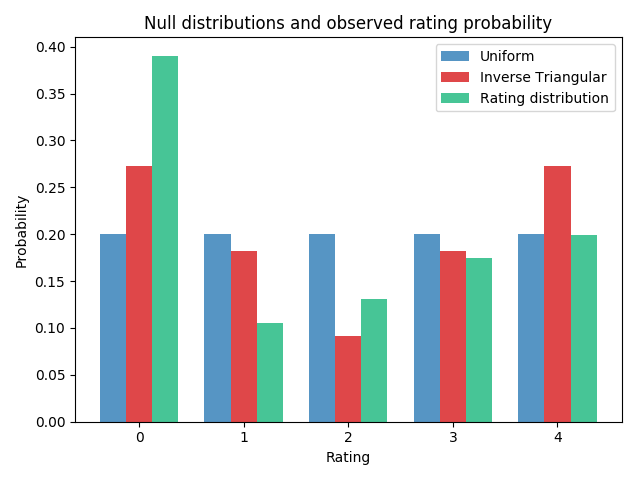
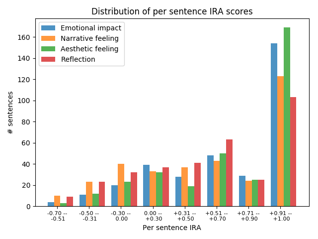

Interrater Agreement

To see if raters interpret the rating task in the same way, we computed Interrater Agreement (IRA). Following the review of IRA measures by O’Neill (2017), we use the IRA statistic r\*wg (Lindell and Brandt 1997) which is a modified version of the original rwg statistic (James et al. 1984, James et al. 1993). The original was developed for rater reliability on Likert scales for single items, but was found to be more an indicator of agreement (James et al. 1993). One of the main drawbacks of the standard rwg statistic is that it suffers from potentially inadmissible values. It computes the ratio of observed rater variance over the expected variance if raters provided random ratings, but can lead to agreement scores above +1.0 or below 0. The modified r\*wg takes values in the [-1,1] interval and statistic makes negative agreement scores interpretable (as a form of disagreement between subgroups of raters) and results in agreement scores that are always in the interval of admissible and interpretable values, e.g [-1,1]. Although there some concerns that Likert scale ratings cannot be interpreted as interval data (Jamieson 2004), others have pointed out that in many cases the errors produced by treating them as such are minimal (Norman 2010). 

The statistic is computed as: rwg = 1 - SX2 / σ2 

Where SX2 is the variance of the ratings for a sentence and σ2 is the expected variance based on a chosen theoretical null-distribution that represents a total lack of agreement. LeBreton and Senter (2008) argue that the choice of null-distribution should be guided by the specifics of the experiment and the biases in responses. The most used null-distribution is the uniform null (σeu2), which assumes that all ratings are equally likely to be chosen. For a 5-point Likert scale, that results in an expected variance of 2, but the actual variance of the raters can range between 0 and 4, hence the IRA can range between -1 and +1. Other choices of null-distribution make different assumptions of how likely different ratings are chosen. In some cases, raters may have a tendency to avoid the extreme ratings (central tendency), so the middle ratings are more likely, and the null-distribution should reflect this (e.g. a triangular distribution where the middle rating is twice as likely as its neighbouring ratings and three times as likely as the extreme ratings, see LeBreton and Senter (2008, p. 832)). Another option, proposed by Lindell et al (1999), is using the maximum dissensus null-distribution  (σmv2), in which the expected variance is the maximum possible variance (raters always choose one of the extremes). The 3896 ratings in our show a tendency towards the extremes, with the lowest possible rating r=0 being the most likely (39%), followed by the highest possible rating r=4 (20%), with the second lowest rating r=1 being the least likely (11%). This corresponds to an average expected variance of 2.54. This is somewhere in between the uniform null-distribution and maximum dissensus, and closest to an 'inverse triangular' distribution which has an expected variance of 2.55. We therefore adopt the inverse triangular null distribution as our theoretical null in calculating agreement, such that agreement score fall in the range [-0.57, +1].

Raters could indicate if they could not judge a sentence at all. This happened mostly for very short sentences that are uninterpretable without the rest of the review as context, such as ‘Uren.’ (‘Hours.’) or ‘En daar is eigenlijk maar een reden voor.’ (‘And there is only one reason for that’). Of the 348 sentences, 15 were marked as such by at least two of the raters, so no agreement can be computed. These are left out of the rest of the analysis. Although we could have screened the random selection of sentences to filter out such cases, this would make the sample less random and would introduce our own biases for what is interpretable.

Figure 1. Distribution of IRA scores per sentence, for the four impact categories.

The distribution of IRA scores per sentence and impact category is shown in Figure x. The average IRA is moderate for emotional impact (0.62) and for aesthetic feeling (0.65), and weak for narrative feeling (0.49) and reflection (0.48). We see two main explanations for this lower agreement for the latter two. One explanation is that raters did not have a concrete enough idea of what each category meant so that they rated inconsistently. It is also possible that the individual sentences did not give enough context for the reviewer’s thinking, forcing the raters to fill in the gaps with their own interpretations. This last explanation is somewhat supported by the fact that raters indicated for some sentences that they could not judge them on these categories. 

## References

James, L. R., Demaree, R. G., and Wolf, G. (1984). Estimating within group interrater reliability with and without response bias. J. Appl. Psychol. 69, 85–98. doi: 10.1037/0021-9010.69.1.85

James, L. R., Demaree, R. G., and Wolf, G. (1993). rwg: an assessment of within group interrater agreement. J. Appl. Psychol. 78, 306–309. doi: 10.1037/0021-9010.78.2.306

Jamieson, S. (2004). Likert scales: how to (ab) use them. Medical education, 38(12), 1217-1218.

LeBreton, J. M., & Senter, J. L. (2008). Answers to 20 questions about interrater reliability and interrater agreement. Organizational research methods, 11(4), 815-852. 

Lindell, M. K., and Brandt, C. J. (1997). Measuring interrater agreement for ratings of a single target. Appl. Psychol. Meas. 21, 271–278. doi: 10.1177/01466216970213006

Norman, G. (2010). Likert scales, levels of measurement and the “laws” of statistics. Advances in health sciences education, 15(5), 625-632.

